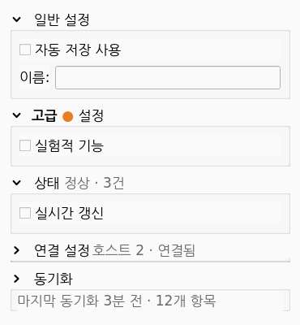

# pyqt-collapsible-groupbox-widget

제목을 클릭하면 **접고 펼 수 있는** `QGroupBox` 위젯.
기존 `QGroupBox` 와 API 가 호환되며, 추가되는 것은 **접기/펴기 기능 하나**뿐이다.

- 접으면 제목 줄만 남고 내부 콘텐츠는 모두 감춰진다.
- 제목 앞에 접기/펴기 아이콘을 직접 그려(안티앨리어싱) 상태를 보여준다.
  기본은 셰브론(펼침 ˅ / 접힘 ›)이며 삼각형·플러스마이너스로도 바꿀 수 있다(`setArrowStyle`).
- 제목 영역을 클릭하면 토글된다(별도 버튼 불필요).
- 펼침/접힘은 부드러운 애니메이션으로 처리된다(끌 수 있음).
- **qtpy** 추상화로 **PyQt5 / PyQt6 / PySide2 / PySide6** 모두에서 동작한다.



## 설치

```bash
pip install -e .
# Qt 바인딩은 택1로 별도 설치 (qtpy 가 자동 감지)
pip install PyQt5      # 또는 PySide6 / PySide2 / PyQt6
```

`src-layout` 패키지다. import 이름은 `collapsible_groupbox`, 배포 이름은 `pyqt-collapsible-groupbox-widget`.

## 사용법

기존 `QGroupBox` 를 쓰던 코드에서 **클래스 이름만 바꾸면** 된다.
아래는 위 데모 화면(일반 / HTML 제목 / 요약 옆 / 요약 안쪽)을 그대로 만드는 코드다.

```python
from collapsible_groupbox import CollapsibleGroupBox
from qtpy.QtWidgets import QVBoxLayout, QCheckBox, QLabel, QLineEdit

# 1) 기본 — QGroupBox 대신 이 클래스만 쓰면 접기/펴기가 추가된다
general = CollapsibleGroupBox("일반 설정")
form = QVBoxLayout(general)
form.addWidget(QCheckBox("자동 저장 사용"))
form.addWidget(QLineEdit())
general.collapsedChanged.connect(print)      # 접힘 상태 변화 알림

# 2) HTML(리치텍스트) 제목 — 자동 감지된다
advanced = CollapsibleGroupBox("<b>고급</b> <font color='#e67e22'>●</font> 설정")
QVBoxLayout(advanced).addWidget(QCheckBox("실험적 기능"))

# 3) 접었을 때 제목 오른쪽에 요약 표시 (기본: SummaryBeside)
conn = CollapsibleGroupBox("연결 설정")
QVBoxLayout(conn).addWidget(QCheckBox("자동 재연결"))
conn.setSummaryEnabled(True)
conn.setSummary("호스트 2 · 연결됨")
conn.setCollapsed(True)

# 4) 접었을 때 박스 안쪽 줄에 요약 표시 (SummaryInside)
sync = CollapsibleGroupBox("동기화")
QVBoxLayout(sync).addWidget(QCheckBox("백그라운드 동기화"))
sync.setSummaryEnabled(True)
sync.setSummary("마지막 동기화 3분 전 · 12개 항목")
sync.setSummaryPosition(CollapsibleGroupBox.SummaryInside)
sync.setCollapsed(True)
```

제목 줄(글자뿐 아니라 빈 영역 포함) 어디를 클릭해도 토글되며, 그 위에서는 손가락 커서가 뜬다.

## 공개 API

`CollapsibleGroupBox` 는 `QGroupBox` 의 모든 API(`setTitle`/`title`/`setLayout`/
`setCheckable`/`setFlat` …)를 그대로 지원한다. 추가된 멤버는 다음과 같다.

| 멤버 | 설명 |
|---|---|
| `setCollapsed(bool)` / `isCollapsed()` | 접힘 상태 설정/조회 |
| `collapsed` (Qt 프로퍼티) | Qt Designer·스타일시트용 bool 프로퍼티 |
| `collapse()` / `expand()` / `toggleCollapsed()` | 접기 / 펴기 / 토글 |
| `setCollapsible(bool)` / `isCollapsible()` | 접기 기능 on/off (off 면 항상 펼침 고정) |
| `setAnimated(bool)` / `isAnimated()` | 애니메이션 사용 여부 (기본 True) |
| `setAnimationDuration(ms)` / `animationDuration()` | 애니메이션 길이 (기본 180ms) |
| `setArrowColor(color)` | 화살표 색 지정 (`QColor`/`"red"`/`"#3498db"`, `None`=글자색) |
| `setArrowStyle(style)` / `arrowStyle()` | 아이콘 모양: `ArrowChevron`(˅/›, 기본) / `ArrowTriangle`(▼/▶) / `ArrowPlusMinus`(−/+) |
| `setTitle(text)` | 일반 텍스트 또는 **HTML**(`<b>`, `<font color>` 등) 지원 |
| `setSummaryEnabled(bool)` / `isSummaryEnabled()` | **접었을 때** 헤더에 요약 표시 기능 on/off (기본 off) |
| `setSummary(text)` / `summary()` | 접었을 때 보일 요약 텍스트(HTML 가능) |
| `setSummaryPosition(pos)` / `summaryPosition()` | 요약 위치: `SummaryBeside`(제목 오른쪽, 기본) / `SummaryInside`(박스 안쪽 줄) |
| `summaryLabel()` | 요약 `QLabel` 직접 접근 (색·폰트·스타일시트 커스터마이즈) |
| `collapsedChanged(bool)` 시그널 | 접힘 상태가 바뀔 때 발생 (True=접힘) |

요약 위치 상수는 `CollapsibleGroupBox.SummaryBeside` / `.SummaryInside` 이다.
제목 위치/스타일은 `QGroupBox` 표준 스타일시트(`QGroupBox::title { ... }`)로 조정한다.

> `title()` 은 `setTitle` 에 넣은 **원본**을 그대로 반환한다(HTML 이면 HTML, 화살표 들여쓰기 제외).
> 좁은 폭에서 일반 제목은 말줄임(…)으로, HTML 제목은 폭이 부족하면 우측이 잘린다.

## 예제

```bash
python3 examples/basic_example.py        # 여러 그룹 + 외부 토글 버튼
python3 examples/embed_in_your_app.py     # 기존 앱 임베드 최소 예제
```

## 테스트

```bash
QT_QPA_PLATFORM=offscreen python3 -m pytest -q
```

## 라이선스

GPL-2.0-or-later
